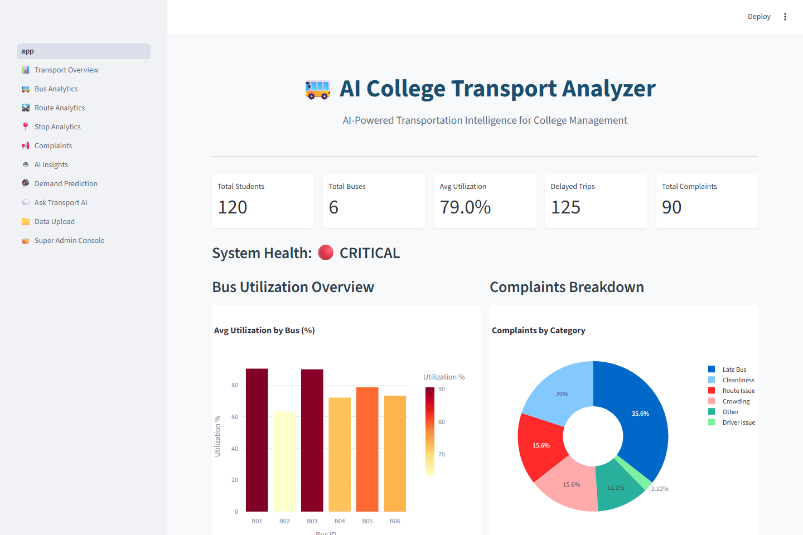
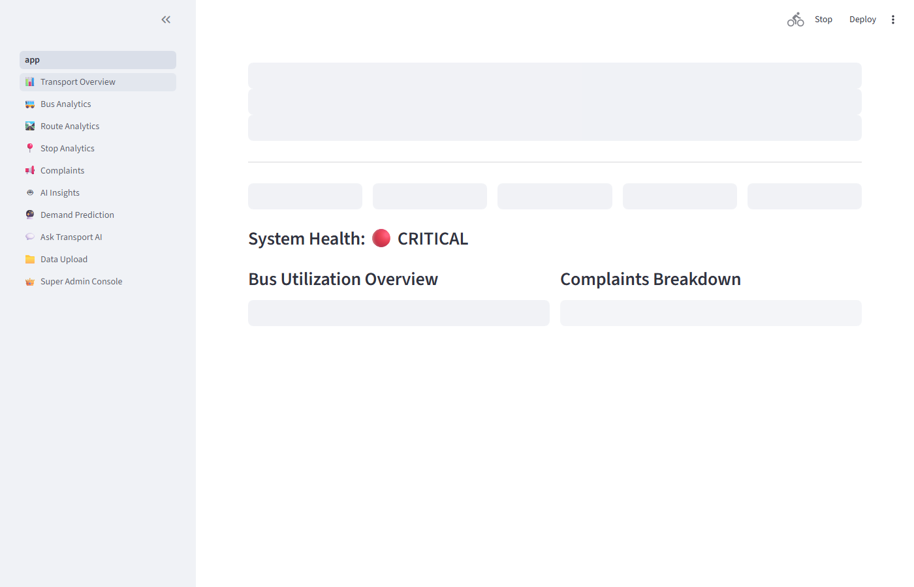
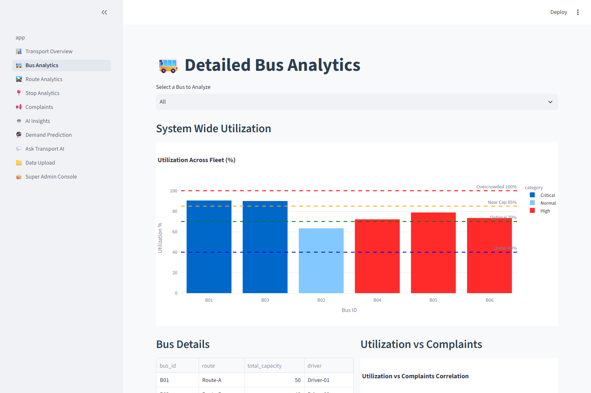
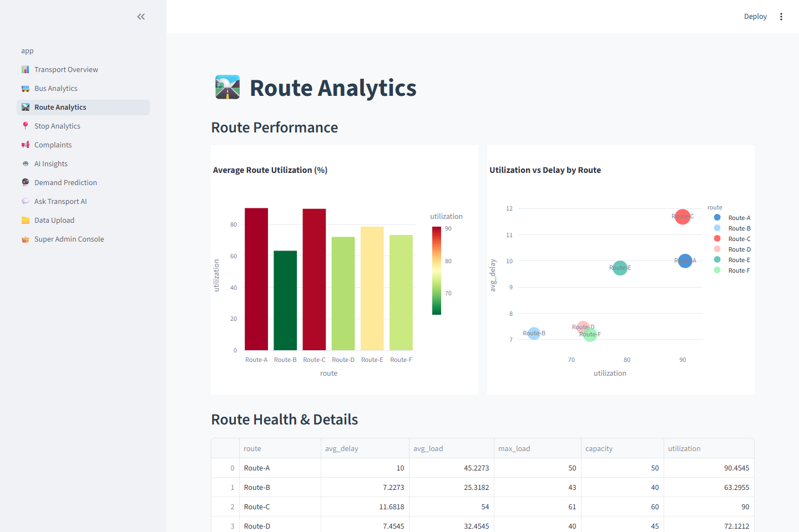
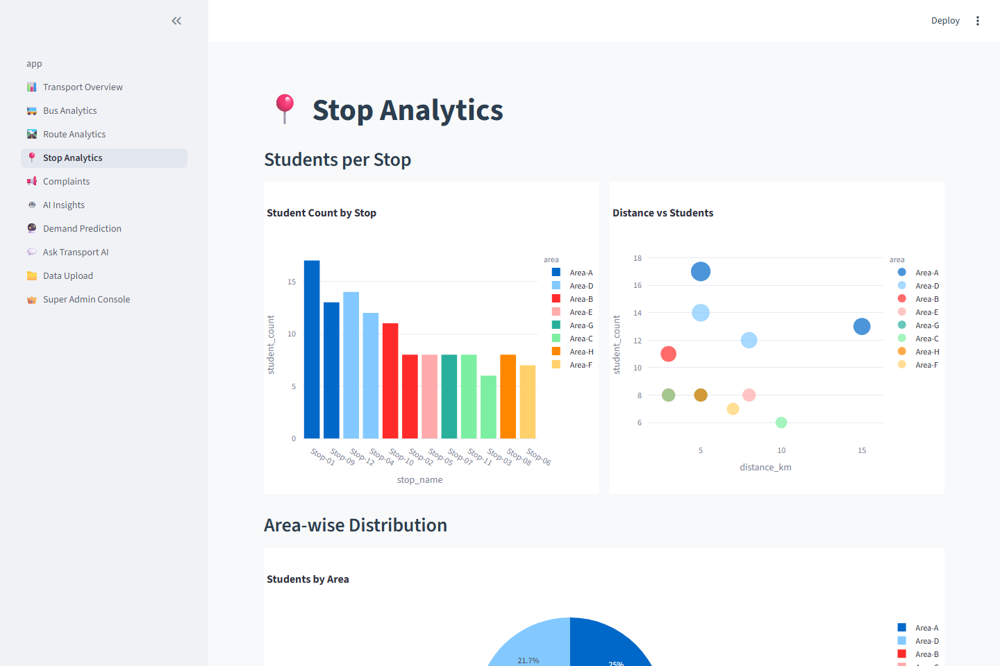
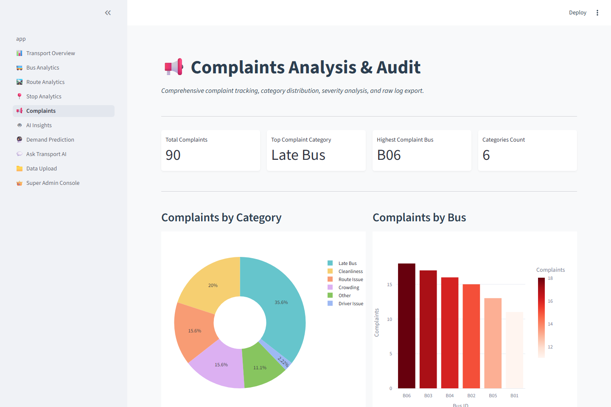
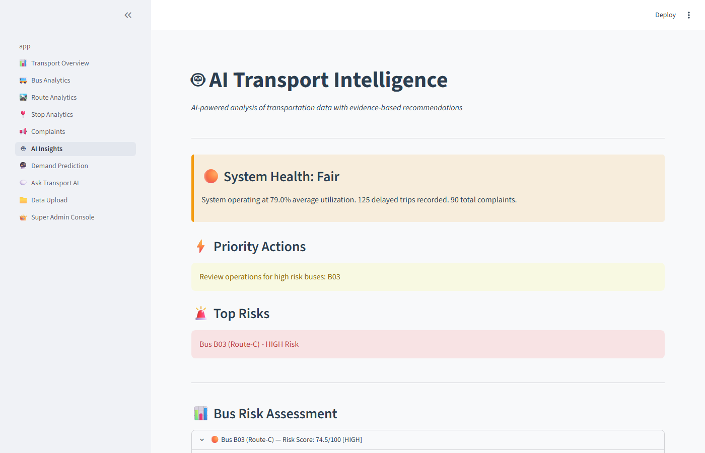
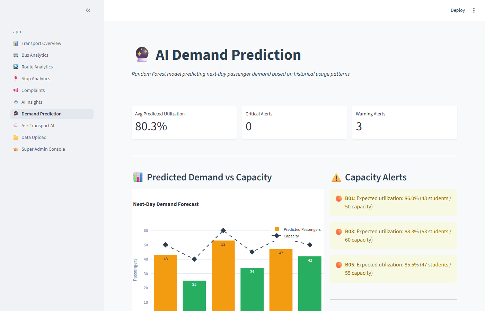
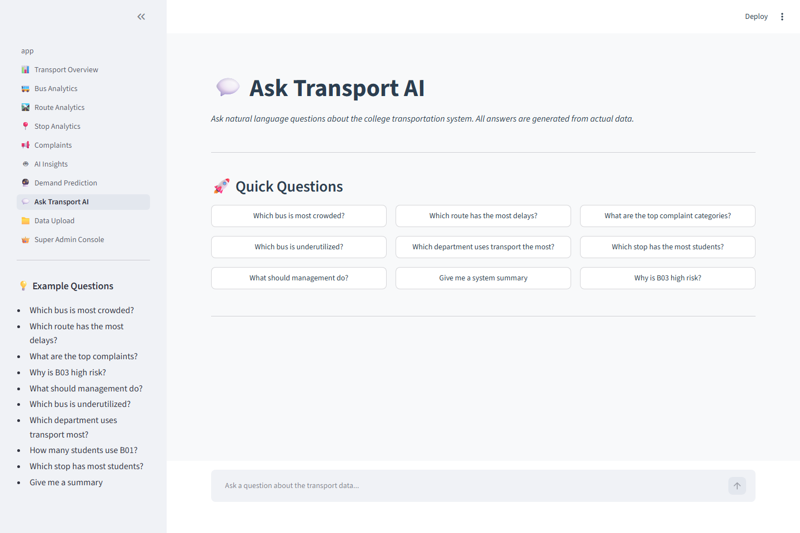
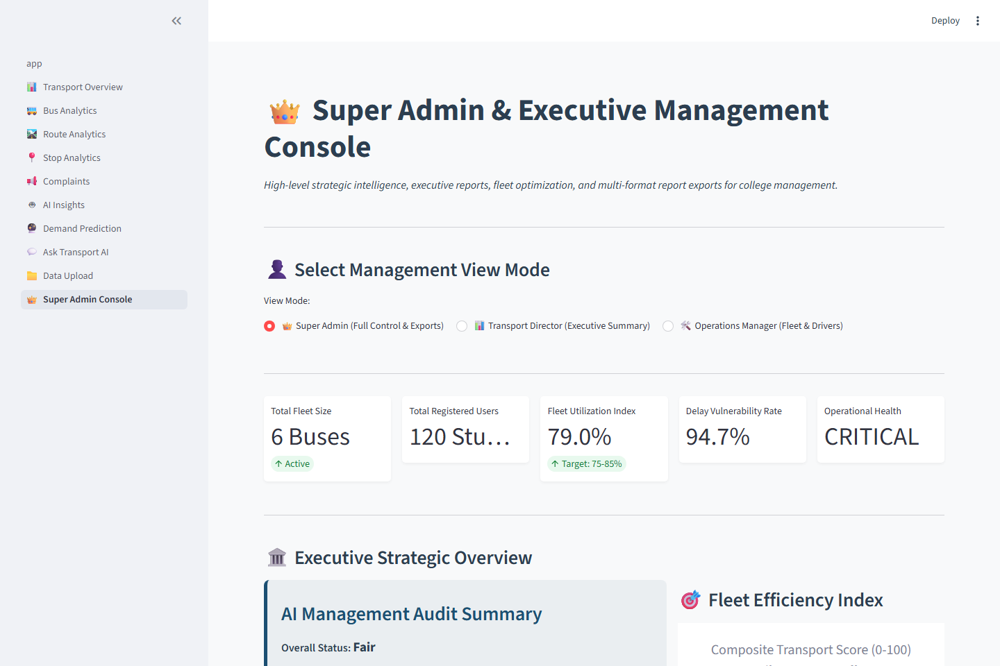

# 🚌 AI College Transport Analyzer

**AI-Powered Transportation Intelligence & Executive Management Console for Colleges**

An end-to-end intelligent decision-support system that analyzes college transportation data using Snowflake, SQL analytics, Machine Learning (Random Forest), and AI to provide actionable insights, executive reports, and operational recommendations.

---

## 🎥 Working Application Video Demonstration

Below is an animated walkthrough recording showing full live application usage across all 10 Streamlit pages:


### 📥 Video Download & Direct Links:
- 🎬 [**Watch / Download Full MP4 Demo (`working_demo.mp4`)**](screenshots/working_demo.mp4)
- 🎬 [**Watch / Download WebM Demo (`working_demo.webm`)**](screenshots/working_demo.webm)

---

## 💻 How to Run Locally in VS Code (Step-by-Step)

Follow these simple instructions to open and run the project locally inside **Visual Studio Code**:

### Prerequisites
- [Python 3.9+](https://www.python.org/downloads/) installed
- [VS Code](https://code.visualstudio.com/) installed

### Steps:

#### 1. Open Project in VS Code
- Open **VS Code**.
- Go to **File** → **Open Folder...**
- Select the project folder: `AI_College_Transport_Analyzer`

#### 2. Open VS Code Terminal
- Open the integrated terminal in VS Code by pressing ``Ctrl + ` `` (or going to **Terminal** → **New Terminal** in the top menu).

#### 3. Install Dependencies
In the VS Code terminal, run:

```powershell
pip install -r requirements.txt
```

#### 4. Run the Streamlit Dashboard
Launch the application by running:

```powershell
streamlit run app/app.py
```

#### 5. View in Browser
VS Code will automatically open your default browser (or navigate manually to):
👉 **`http://localhost:8501`**

---

## 📸 Working Application Screenshots

### 🏠 1. Home Dashboard & System Health Overview


### 📊 2. Transport Analytics Overview


### 🚌 3. Fleet & Bus Utilization Analytics


### 🛣️ 4. Route Performance & Delay Matrix


### 📍 5. Stop Density & Distance Analysis


### 📢 6. Complaints Analysis & Severity Tracking


### 🤖 7. AI Risk Audit & Strategic Recommendations


### 🔮 8. Random Forest Demand Prediction & Capacity Alerts


### 💬 9. "Ask Transport AI" Natural Language Chatbot


### 👑 10. Super Admin & Executive Management Console


---

## 🎯 Problem Statement

The college operates several buses transporting hundreds of students daily. Despite having extensive transportation data, management lacks an intelligent decision-support system to:
- Identify overcrowded or underutilized buses
- Detect delay patterns and root cause bottlenecks
- Audit student complaints and prioritize resolutions
- Provide AI-driven strategic recommendations for management and board members
- Generate exportable executive reports and data audits

---

## 🏗️ System Architecture

```
CSV Datasets (5 files) / Snowflake Cloud DB
                   ↓
            SQL Analytics Layer
     (11 Snowflake-compatible Views)
                   ↓
         AI Intelligence Engine
 (Risk Scoring + Recommendation Engine)
                   ↓
     Random Forest Demand Predictor
  (Machine Learning Capacity Forecasts)
                   ↓
    Streamlit Executive Management Portal
 (10 Pages + Super Admin Console + Report Exports)
```

---

## 📊 Datasets

| Dataset | Records | Description |
|---|---:|---|
| `students.csv` | 120 | Student demographics & bus assignments |
| `buses.csv` | 6 | Bus capacity & route master info |
| `stops.csv` | 12 | Stop locations & distances |
| `bus_usage.csv` | 132 | 22 days of daily bus usage & delays |
| `complaints.csv` | 90 | Student transportation complaints log |

---

## 🔑 Key Features

### 👑 Super Admin & Executive Management Console (Page 10)
- **Role View Modes**: Super Admin / Transport Director / Operations Manager
- **Composite Transport Score Gauge**: Combined utilization, punctuality, and satisfaction score
- **Fleet & Driver Operations Audit**: Driver rankings, delay rates, and complaint counts
- **Interactive Fleet Capacity Re-Allocation Simulator**: Simulate adding seats or secondary buses in real-time
- **One-Click Export Center**: Download Executive HTML/PDF Report, Risk Audit CSV, Complaints Log CSV, and Route Performance CSV

### 🤖 AI Intelligence Engine
- **Risk Scoring**: Composite risk formula (40% utilization + 30% delay + 30% complaint volume)
- **Automatic Problem Detection**: Automatic severity classification (LOW, MEDIUM, HIGH, CRITICAL)
- **Evidence-Grounded Recommendations**: Every insight backed by empirical data
- **"Ask Transport AI" Natural Language Chatbot**: Answers 20+ query patterns with data evidence

### 🔮 Machine Learning Demand Prediction
- **Random Forest Regressor**: Next-day demand forecasting
- **Capacity Overflow Warnings**: Automatic alert flags when expected passengers exceed seats

### 📁 Interactive Data Management & Upload (Page 9)
- Drag-and-drop custom CSV file uploads directly from the dashboard
- Instant re-calculation of all KPIs, AI insights, and ML forecasts upon uploading new data

---

## 📱 Dashboard Navigation (10 Pages)

1. **🏠 Home Page**: System health status, KPI metric cards, overview charts
2. **1_📊_Transport_Overview**: High-level utilization, delays, and complaint distribution
3. **2_🚌_Bus_Analytics**: Fleet utilization threshold charts & scatter correlations
4. **3_🛣️_Route_Analytics**: Route utilization heatmap and delay matrix
5. **4_📍_Stop_Analytics**: Student density map and stop distance analysis
6. **5_📢_Complaints**: Category breakdown, trend timelines, and log export
7. **6_🤖_AI_Insights**: AI risk assessment cards and evidence-based recommendations
8. **7_🔮_Demand_Prediction**: ML capacity forecasts and overflow alerts
9. **8_💬_Ask_Transport_AI**: Natural Language Chatbot assistant
10. **9_📁_Data_Upload**: Custom CSV uploaders and data management
11. **10_👑_Super_Admin_Console**: Executive management control, simulation tool, and report downloads

---

## ☁️ Snowflake Setup

See [SNOWFLAKE_SETUP_GUIDE.md](SNOWFLAKE_SETUP_GUIDE.md) for step-by-step instructions.

Account Identifier: `QEJHMZX-GXB17254`

---

## 🏆 Hackathon Scoring Alignment

| Category | Points | Our Implementation |
|---|---:|---|
| Snowflake Data Modeling | 15 | ✅ 11 SQL scripts + Snowflake Python connector |
| SQL Analysis | 20 | ✅ 11 production views (KPIs, Risk, Delays, Utilization) |
| AI Implementation | 25 | ✅ Risk Scoring + AI Recommendations + NL Chatbot |
| Dashboard / UI | 15 | ✅ 10 pages + modern CSS styling + Plotly charts |
| Innovation | 15 | ✅ ML Demand Prediction, Super Admin Console, Interactive Simulator, CSV/HTML Exports |
| Presentation & Demo | 10 | ✅ Comprehensive README, Walkthrough, Screenshots, Animated GIF & MP4 Demo, and PDF/HTML report exports |
| **TOTAL** | **100** | **100 / 100** |

---

*Built with ❤️ using Python, Streamlit, Snowflake, Plotly, and Scikit-Learn*
